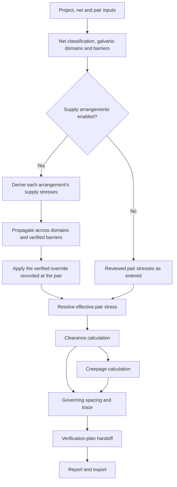
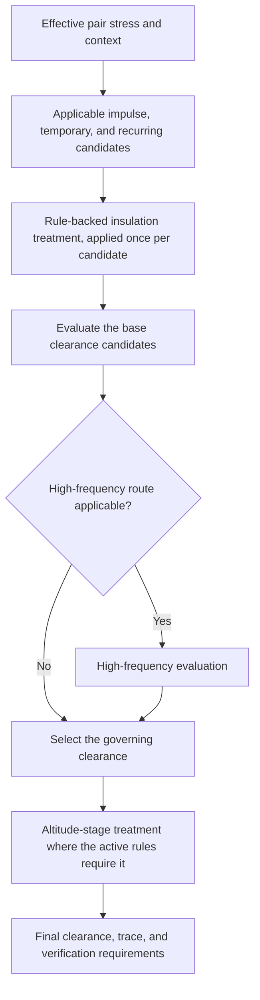
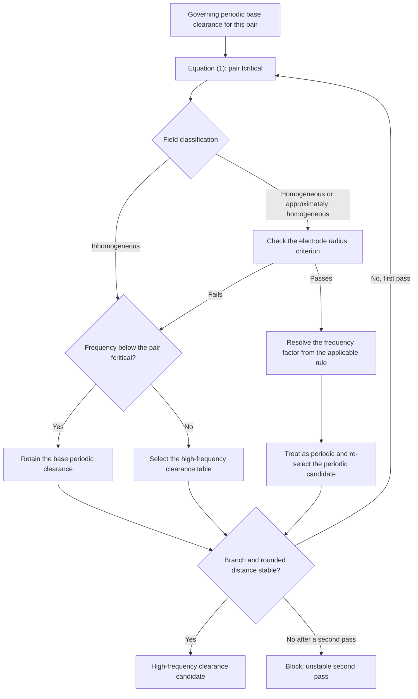
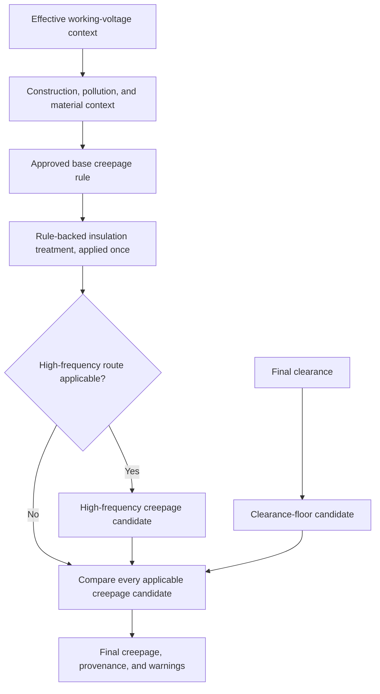
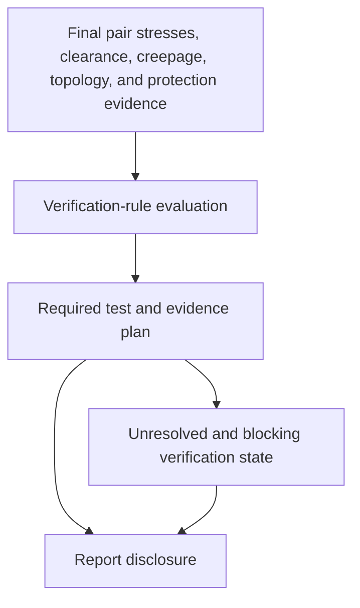

# Insulation Coordination Calculator

Offline desktop application that calculates auditable functional, basic, and reinforced
clearance and creepage requirements from approved private IEC rule packages and generates
LaTeX/PDF insulation-coordination reports.

> [!IMPORTANT]
> This software does not include IEC rules, tables, or licensed standard PDFs. To calculate
> results, you must create or obtain an approved `.icrules` package through the Rules Manager.
> The package is the rule set used by the application and may be shared within your company
> team only in accordance with your organization's standards licence and procedures.

## Highlights

- Python 3.12 + PySide6 desktop shell with a UI-independent domain engine.
- Versioned `.icproj` projects and deterministic `.icrules` rule archives.
- `Decimal`-only engineering arithmetic; every lookup, formula, substitution,
  interpolation, correction, and rounding step is traced and referenced.
- Full audit browser in the Rules Manager: tables, formulas, mappings, checksums,
  validation, and CSV/JSON inventory export.
- Offline LaTeX/PDF compilation through a bundled, pinned Tectonic executable in packaged
  builds; development runs can use Tectonic on `PATH` or an explicitly supplied executable.
- Blocked final report generation while any pair has a blocking error.
- Never executes code from rule packages; only whitelisted declarative operators.

## PCB-only product boundary

This software calculates insulation coordination for printed circuit boards only. It
supports functional, basic, and reinforced insulation with PCB construction and the
explicit IEC branches listed below. It does not silently substitute conventional
wiring or generic-material rules.

Required source inventory:

- IEC 60664-1: `iec60664-1-f2`, joined two-page `iec60664-1-f5`,
  `iec60664-1-f8`, advisory `iec60664-1-f9`, and altitude table
  `iec60664-1-a2`.
- IEC 60664-4: `iec60664-4-table-1`, `iec60664-4-table-2`, Equation (1)
  critical frequency, Equation (2) frequency factor, minimum-frequency statement,
  and radius criterion.

F.3, F.4, and IEC 60664-4 Table 5 are not calculation inputs. Older packages that
used those artifacts or placeholder formulas must be regenerated from the licensed
PDFs.

## Rules Manager review workflow

1. Select both licensed PDFs together: IEC 60664-1 and IEC 60664-4. The importer
   identifies the supported editions and extracts raw grids, semantic headings,
   equations, mappings, footnotes, and source cells.
2. Review the extracted tables and raw cells. Review is read-only until a reviewer
   records identity and notes for an acceptance or correction.
3. Review the extracted equations and semantic mappings. Formula-targeted mappings
   appear with their formula; table-targeted PCB mappings appear as separate
   `Mapping:` entries.
4. Click `Build reviewed content` after table/raw-cell and equation/mapping review
   is complete. Provide the required notes and resolve any remaining review items.
5. Click `Approve reviewed draft` and provide approver identity and approval notes.
   Approval is blocked until the draft is fully resolved and passes validation.
6. Click `Export approved package` to write the deterministic `.icrules` archive.
7. Share the approved `.icrules` file internally where permitted, and use
   `Import approved .icrules` on other team installations. The receiving installation
   does not need the source PDFs.

Approval switches the Rules Manager to the approved package. Export writes the
shareable archive; later import installs and activates that archive on another
installation.

During review, the Audit tree shows draft provenance and pending/accepted review
state. After approval, it shows the full package audit, including the manifest,
checksums, tables, formulas, mappings, and validation.

Required-content and manual-review counts measure different things. Required content
counts one expected table, formula, or mapping. Manual review counts every approval
item, including ambiguous raw cells. Therefore the totals are not required to
match; they may be equal when every semantic artifact has exactly one review
item.

F.5 is displayed as one logical table joined from PDF pages 73 and 74. Raw display
text remains visible, including grouped thousands, ranges, qualifiers, and footnotes.
Calculation lookups use normalized numeric axes and stable semantic column IDs;
footnote letters and headings never become numeric lookup keys. Recipe-declared
merged cells, such as F.2 spans, are filled only across their covered semantic rows.

## Insulation-coordination workflow

IEC 62477-1:2022 orchestrates the calculation. It decides which nets face each other, which
supply stresses reach them, and what has to be verified afterwards. IEC 60664-1 and
IEC 60664-4 stay underneath it as the dimensioning sources, reached through the approved
compatibility mappings the active package declares.



> The diagrams describe the calculator's own data flow. Normative values and applicability
> decisions are loaded from the active approved `.icrules` package. IEC clause, table, annex,
> and equation identifiers shown here and in generated traces are provenance references, not
> embedded copies of the standards.

A project that enables no supply arrangement reads no supply rule at all. Its pairs are
dimensioned from exactly the stresses entered against them, which is the manual IEC 60664
route and stays available wherever topology or supply data is incomplete or switched off.
Where a project does enable one, the derived and the entered figure are two answers to the
same question and the more severe governs: a derived figure never lowers an entered one, and
either way a disagreement is reported as a warning rather than resolved silently.

Net classification and decisive voltage class are recorded per net; the guidance shown for a
class, and the protection the verification plan later expects of it, are read from
`iec62477_2022.dvc.voltage_limits` and `iec62477_2022.dvc.protection_matrix`. Source stress,
transferred stress, and effective pair stress then stay separate records:
`iec62477_2022.supply.impulse_by_system_voltage_ovc` and
`iec62477_2022.supply.tov_by_system_voltage` answer what an arrangement's system voltage
requires, while `iec62477_2022.supply.multiple_source_propagation` and
`iec62477_2022.supply.verified_barrier_transfer` decide what reaches each galvanic domain. A
barrier recorded as not evaluated is neither isolation nor a connection; it leaves every
domain it could have reached unresolved and blocks automatic propagation onto those pairs
instead of guessing.

Clearance and creepage are separate branches with one ordering constraint between them: the
creepage comparison reads the final clearance, so clearance is dimensioned first. Verification
consumes the finished spacings and stresses and never re-derives them. Every value is
`Decimal` throughout and carries the rule ids, source cells, and substitutions it came from;
a pair that cannot produce a complete trace blocks the final report.

## Clearance calculation workflow



IEC 62477-1:2022 publishes the product-level spacing requirements as
`iec62477_2022.clearance.requirements`, and the stronger insulation is dimensioned from
`iec62477_2022.clearance.reinforced_treatment`, whose own reference names the axis a treated
stress moves along. The dimensioning lookups underneath resolve to IEC 60664-1 routes through
the package's approved compatibility mappings; a missing, ambiguous, or unapproved mapping
blocks the calculation instead of falling back to anything.

Reinforced behavior, interpolation policy, altitude behavior, field treatment, and
high-frequency applicability are rules and data in the package, never constants in this
README. The insulation treatment is applied exactly once, to the stress, immediately before
the table is read, and only for the class whose rule states one; a package that cannot supply
that rule blocks the reinforced pairs and leaves functional and basic pairs untouched.

Blank required stresses block calculation; explicitly not-applicable stresses remain traceable
omissions. Every applicable candidate is evaluated and compared, and the governing branch, its
rule ids, and its source cells are recorded. The altitude correction is the A.2 route the
approved package maps, applied once after that comparison so that it corrects the distance
that governs rather than each candidate separately. Above the peak-voltage threshold the
applicable rule defines, F.9 raises a partial-discharge review advisory for inhomogeneous
fields; it does not replace the governing distance. Homogeneous Case B also carries a
withstand-test verification requirement.

### High-frequency clearance subflow

This branch is subordinate to the clearance workflow above: it contributes candidates to the
same comparison and never replaces it. `fcritical` is computed independently for every pair
from its governing periodic base clearance; the impulse candidate is not used as the
Equation (1) input.



The engine records starting clearance, actual frequency, `fcritical`, the selected branch, the
frequency factor, the radius ratio where relevant, and stability for each pass. A second pass
that is still unstable blocks rather than settling on either answer. Whether this branch runs
at all is still decided by a named constant in
[`calculation/high_frequency.py`](src/insulation_coordination/calculation/high_frequency.py)
rather than by `iec62477_2022.high_frequency.applicability`; that rule and
`iec62477_2022.high_frequency.band_factor` are extracted and inventoried, and moving the
decision onto them is open work tracked with the licensed-content migration.

## Creepage calculation workflow



IEC 62477-1:2022 publishes the product-level creepage requirements as
`iec62477_2022.creepage.requirements`, and the stronger insulation is dimensioned from
`iec62477_2022.creepage.reinforced_treatment`, applied exactly once to the base result. The
base rule itself resolves to an IEC 60664-1 route through the package's approved compatibility
mappings, interpolates only along its own normalized voltage axis, and selects the printed
wiring pollution branch exactly rather than approximating a neighboring one.

The high-frequency creepage rule contributes one more applicable candidate rather than
replacing the base one, and the final clearance enters the same comparison as a floor
candidate, which is what keeps final creepage from ever falling below final clearance. A blank
long-term RMS voltage blocks; one marked not applicable with a justification is a traceable
omission and leaves the clearance floor as the only candidate. Sparse unavailable source
combinations block instead of being guessed. The selected candidate, the reason it governs,
and every rule id behind it stay in the trace.

## Verification handoff



Verification is a downstream consumer of the calculation, not a stage of the distance lookup.
It reads the impulse the supply derivation produced, propagated and adjusted by any verified
override, and it never derives a second figure that could disagree with the one the spacings
were dimensioned from. The plan is recomputed on every read and never persisted, so two runs
of one project produce one plan.

The applicable procedures, the electrodes each test is applied between, and the working
voltage each is assessed at come from the approved package's test rule family, including
`iec62477_2022.test.impulse_procedure` and
`iec62477_2022.test.working_voltage_determination`. This README names those roles and no
procedure values: test voltages, durations, counts, and waveform parameters belong to the
package.

An unselected protection implementation, a working voltage nobody recorded, or a duration no
resolved rule states becomes an unresolved input named on the application it belongs to. There
is no path from "nothing is known" to "not required". An incomplete plan is disclosed in the
report rather than suppressing it, while a blocking calculation error still blocks final report
generation. Detailed user guidance for this workflow is issue #8.

## Unsupported PCB conditions

Calculation blocks with a specific error for:

- non-printed-wiring construction;
- pollution degree outside 1 or 2;
- missing/unknown CTI or material group;
- conventional-construction assumption flags without an approved semantic mapping;
- missing required voltage, frequency, field, insulation, or geometry input;
- homogeneous high-frequency routing without electrode radius;
- value outside a declared table/rule range or a sparse unavailable source cell;
- altitude outside A.2 coverage;
- an unstable second Part 4 pass; or
- obsolete schema/importer packages.

## Trace interpretation

Each result records effective inputs, all candidates, omissions, maximum/floor
selection, normalized values, interpolation/lookup mode, formula substitution,
rounding, source cells, source table/equation, warnings, and verification requirements.
The report is blocked when any pair cannot produce a complete trace.

## Responsibility and disclaimer

The software and its results are decision-support output. They are not certification
and do not replace engineering judgement, review, or the requirements of the applicable
standards. The user is solely responsible for checking the inputs, rule package,
calculations, and results against the applicable standards and project requirements
before relying on them.

The authors and contributors are not responsible for any loss, damage, non-compliance,
injury, or other consequence arising from the use of this software or its results.

## Free cross-platform release

Release artifacts target Windows x86_64, macOS arm64, and Linux x86_64. The free release
does not require a company or paid certificate: the Windows installer is unsigned and
may show a SmartScreen warning; the macOS DMG is ad-hoc signed but not notarized; and
Linux provides an AppImage plus a portable tar archive. Verify every download against
`SHA256SUMS` before opening it.

Windows users can run the installer per-user, choose the optional desktop shortcut, and
open `.icproj` projects or `.icrules` packages by double-clicking them. If SmartScreen
blocks an unsigned installer, use right-click → Open and confirm the publisher warning
only after checking the checksum. Verify with:

```powershell
Get-FileHash .\insulation-coordination-0.1.1-windows-x86_64-setup.exe -Algorithm SHA256
```

On macOS, open the DMG and use Finder right-click → Open for the first launch because
the free artifact is ad-hoc signed and not notarized. Verify with:

```sh
shasum -a 256 insulation-coordination-0.1.1-macos-arm64.dmg
```

On Linux, verify the AppImage, then run `chmod +x insulation-coordination-*.AppImage`
and launch it. If FUSE or desktop integration is unavailable, use the tar archive and
run its `icc` launcher. Optional GPG signatures, when published, can be checked with
`gpg --verify`. The desktop and MIME files route both `.icproj` and `.icrules`.

All three packages contain a verified Tectonic 0.16.9 runtime and warmed cache. Report
compilation is offline; the application does not fall back to a system compiler or home
cache in a frozen package. User projects and installed rules remain outside the app
directory and survive uninstall.

## Contributing

Inputs, bug reports, and improvement ideas are welcome. Please open an issue with
enough context to reproduce or assess the situation. If you would like to collaborate,
pull requests are welcome; describe the change and the verification you performed.

## Implementation map

| Workflow step | Implementation | Focused verification |
| --- | --- | --- |
| Pair orchestration and maxima | [`calculate_pair`](src/insulation_coordination/calculation/engine.py) | [`tests/test_end_to_end.py`](tests/test_end_to_end.py) |
| Supply-stress derivation | [`derive_project_supply`](src/insulation_coordination/calculation/engine.py) | [`tests/calculation/test_supply_stress.py`](tests/calculation/test_supply_stress.py) |
| Topology propagation and effective pair stress | [`resolve_pair_stresses`](src/insulation_coordination/calculation/stress_propagation.py) | [`tests/calculation/test_stress_propagation.py`](tests/calculation/test_stress_propagation.py) |
| Clearance candidates | [`calculate_clearance_candidates`](src/insulation_coordination/calculation/clearance.py) | [`tests/calculation/test_part1.py`](tests/calculation/test_part1.py) |
| Pair `fcritical` | [`calculate_critical_frequency`](src/insulation_coordination/calculation/high_frequency.py) | [`tests/calculation/test_high_frequency.py`](tests/calculation/test_high_frequency.py) |
| Part 4 clearance passes | [`assess_part4_clearance`](src/insulation_coordination/calculation/high_frequency.py) | [`tests/calculation/test_high_frequency.py`](tests/calculation/test_high_frequency.py) |
| A.2 correction | [`apply_a2_altitude_correction`](src/insulation_coordination/calculation/high_frequency.py) | [`tests/calculation/test_high_frequency.py`](tests/calculation/test_high_frequency.py) |
| Creepage candidates | [`calculate_creepage_candidates`](src/insulation_coordination/calculation/creepage.py) | [`tests/calculation/test_part1.py`](tests/calculation/test_part1.py) |
| Joined F.5 PCB selection | [`select_f5_pcb_creepage`](src/insulation_coordination/calculation/creepage.py) | [`tests/calculation/test_part1.py`](tests/calculation/test_part1.py) |
| Part 4 Table 2 | [`select_part4_table2_creepage`](src/insulation_coordination/calculation/high_frequency.py) | [`tests/calculation/test_high_frequency.py`](tests/calculation/test_high_frequency.py) |
| Dielectric verification plan | [`VerificationPlanService`](src/insulation_coordination/calculation/verification_plan.py) | [`tests/calculation/test_verification_plan.py`](tests/calculation/test_verification_plan.py) |
| PDF review/build/approval | [`rules/importer`](src/insulation_coordination/rules/importer/) | [`tests/private/test_supplied_standards.py`](tests/private/test_supplied_standards.py) |

## Development

```bash
uv sync --locked --all-groups
uv run ruff check .
uv run mypy
uv run pytest
```

## Desktop

```bash
uv run icc --gui
```

## Packaging

- Windows: `packaging/insulation_coordination.spec` (PyInstaller) +
  `installer/insulation-coordination.iss` (Inno Setup).
- macOS: same spec with `--windowed`; bundle as `.app` with document types.
- CI: `.github/workflows/windows-package.yml` and `.github/workflows/macos-package.yml`.
- See `docs/release-checklist.md` for the acceptance matrix.

Private licensed IEC PDFs, `.icrules`, `.icproj`, audit exports, and derived values must
remain local and must not be committed or published. Common private locations and file
types are ignored by default in `/.gitignore`; verify any new storage paths before adding
files to the repository.
