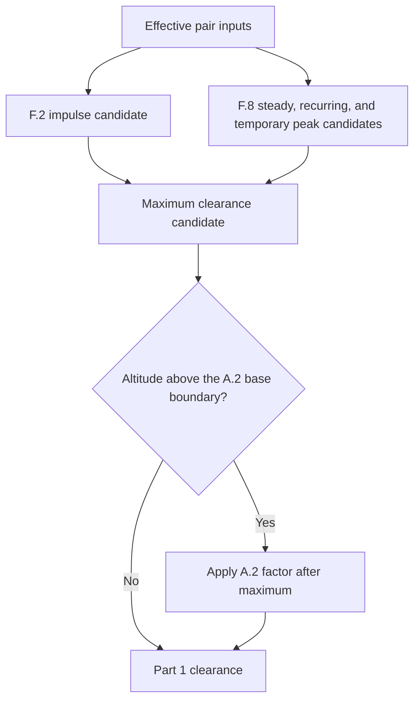
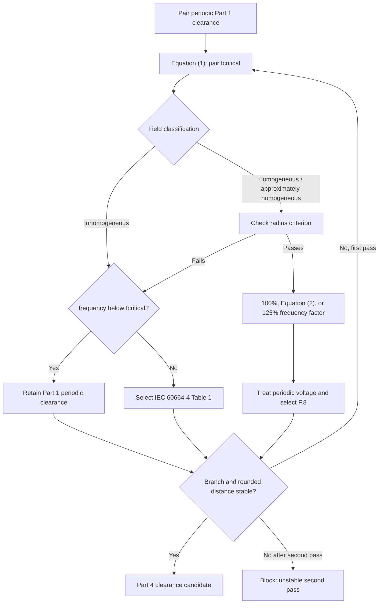
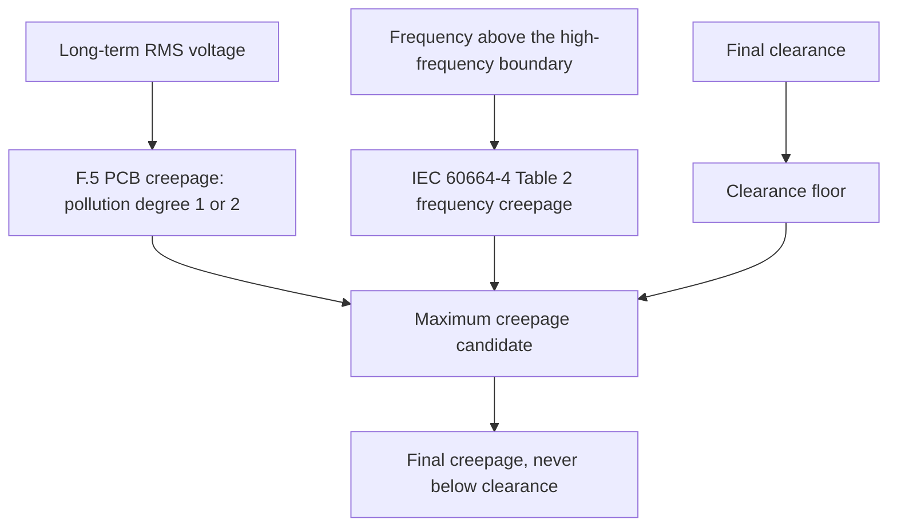

# Insulation Coordination Calculator

Offline desktop application that calculates auditable functional, basic, and reinforced
clearance and creepage requirements from approved private IEC rule packages and generates
LaTeX/PDF insulation-coordination reports.

> [!IMPORTANT]
> This software does not include IEC rules, tables, or licensed standard PDFs. To calculate
> results, you must create or obtain an approved `.icrules` package through the Rules Manager.
> The package is the rule set used by the application and may be shared within your company
> team only in accordance with your organization's standards licence and procedures.

## Highlights

- Python 3.12 + PySide6 desktop shell with a UI-independent domain engine.
- Versioned `.icproj` projects and deterministic `.icrules` rule archives.
- `Decimal`-only engineering arithmetic; every lookup, formula, substitution,
  interpolation, correction, and rounding step is traced and referenced.
- Full audit browser in the Rules Manager: tables, formulas, mappings, checksums,
  validation, and CSV/JSON inventory export.
- Offline LaTeX/PDF compilation through a bundled, pinned Tectonic executable in packaged
  builds; development runs can use Tectonic on `PATH` or an explicitly supplied executable.
- Blocked final report generation while any pair has a blocking error.
- Never executes code from rule packages; only whitelisted declarative operators.

## PCB-only product boundary

This software calculates insulation coordination for printed circuit boards only. It
supports functional, basic, and reinforced insulation with PCB construction and the
explicit IEC branches listed below. It does not silently substitute conventional
wiring or generic-material rules.

Required source inventory:

- IEC 60664-1: `iec60664-1-f2`, joined two-page `iec60664-1-f5`,
  `iec60664-1-f8`, advisory `iec60664-1-f9`, and altitude table
  `iec60664-1-a2`.
- IEC 60664-4: `iec60664-4-table-1`, `iec60664-4-table-2`, Equation (1)
  critical frequency, Equation (2) frequency factor, minimum-frequency statement,
  and radius criterion.

F.3, F.4, and IEC 60664-4 Table 5 are not calculation inputs. Older packages that
used those artifacts or placeholder formulas must be regenerated from the licensed
PDFs.

## Rules Manager review workflow

1. Select both licensed PDFs together: IEC 60664-1 and IEC 60664-4. The importer
   identifies the supported editions and extracts raw grids, semantic headings,
   equations, mappings, footnotes, and source cells.
2. Review the extracted tables and raw cells. Review is read-only until a reviewer
   records identity and notes for an acceptance or correction.
3. Review the extracted equations and semantic mappings. Formula-targeted mappings
   appear with their formula; table-targeted PCB mappings appear as separate
   `Mapping:` entries.
4. Click `Build reviewed content` after table/raw-cell and equation/mapping review
   is complete. Provide the required notes and resolve any remaining review items.
5. Click `Approve reviewed draft` and provide approver identity and approval notes.
   Approval is blocked until the draft is fully resolved and passes validation.
6. Click `Export approved package` to write the deterministic `.icrules` archive.
7. Share the approved `.icrules` file internally where permitted, and use
   `Import approved .icrules` on other team installations. The receiving installation
   does not need the source PDFs.

Approval switches the Rules Manager to the approved package. Export writes the
shareable archive; later import installs and activates that archive on another
installation.

During review, the Audit tree shows draft provenance and pending/accepted review
state. After approval, it shows the full package audit, including the manifest,
checksums, tables, formulas, mappings, and validation.

Required-content and manual-review counts measure different things. Required content
counts one expected table, formula, or mapping. Manual review counts every approval
item, including ambiguous raw cells. Therefore the totals are not required to
match; they may be equal when every semantic artifact has exactly one review
item.

F.5 is displayed as one logical table joined from PDF pages 73 and 74. Raw display
text remains visible, including grouped thousands, ranges, qualifiers, and footnotes.
Calculation lookups use normalized numeric axes and stable semantic column IDs;
footnote letters and headings never become numeric lookup keys. Recipe-declared
merged cells, such as F.2 spans, are filled only across their covered semantic rows.

## Annex G clearance workflow



F.2 uses impulse withstand voltage. F.8 evaluates every applicable periodic peak;
blank required stresses block calculation, while explicitly not-applicable stresses
remain traceable omissions. The largest candidate governs. A.2 is applied once, after
that maximum. At and above the peak-voltage threshold defined by the applicable rule,
F.9 produces a partial-discharge review advisory for inhomogeneous fields; it does
not replace the governing distance.
Homogeneous Case B also carries a withstand-test verification requirement.

## Pair-specific critical-frequency flow

Above the high-frequency boundary, `fcritical` is computed independently for every pair
from its governing periodic Part 1 clearance; impulse clearance is not used as the
Equation (1) input.



The engine records starting clearance, actual frequency, `fcritical`, selected branch,
frequency factor, radius ratio when relevant, and stability for each pass. At most two
passes are allowed.

## Annex H creepage workflow



F.5 interpolates only along its normalized voltage axis and selects the PCB pollution
branch exactly. Reinforced insulation applies the treatment defined by the approved
rule to the F.5 result. Above the high-frequency boundary, Table 2 adds a
voltage-ceiling/frequency-linear candidate using the band structure and pollution
multiplier the table declares. Sparse unavailable source combinations block instead
of being guessed. Final creepage is the maximum of F.5, Table 2 when applicable, and
final clearance.

## Unsupported PCB conditions

Calculation blocks with a specific error for:

- non-printed-wiring construction;
- pollution degree outside 1 or 2;
- missing/unknown CTI or material group;
- conventional-construction assumption flags without an approved semantic mapping;
- missing required voltage, frequency, field, insulation, or geometry input;
- homogeneous high-frequency routing without electrode radius;
- value outside a declared table/rule range or a sparse unavailable source cell;
- altitude outside A.2 coverage;
- an unstable second Part 4 pass; or
- obsolete schema/importer packages.

## Trace interpretation

Each result records effective inputs, all candidates, omissions, maximum/floor
selection, normalized values, interpolation/lookup mode, formula substitution,
rounding, source cells, source table/equation, warnings, and verification requirements.
The report is blocked when any pair cannot produce a complete trace.

## Responsibility and disclaimer

The software and its results are decision-support output. They are not certification
and do not replace engineering judgement, review, or the requirements of the applicable
standards. The user is solely responsible for checking the inputs, rule package,
calculations, and results against the applicable standards and project requirements
before relying on them.

The authors and contributors are not responsible for any loss, damage, non-compliance,
injury, or other consequence arising from the use of this software or its results.

## Free cross-platform release

Release artifacts target Windows x86_64, macOS arm64, and Linux x86_64. The free release
does not require a company or paid certificate: the Windows installer is unsigned and
may show a SmartScreen warning; the macOS DMG is ad-hoc signed but not notarized; and
Linux provides an AppImage plus a portable tar archive. Verify every download against
`SHA256SUMS` before opening it.

Windows users can run the installer per-user, choose the optional desktop shortcut, and
open `.icproj` projects or `.icrules` packages by double-clicking them. If SmartScreen
blocks an unsigned installer, use right-click → Open and confirm the publisher warning
only after checking the checksum. Verify with:

```powershell
Get-FileHash .\insulation-coordination-0.1.1-windows-x86_64-setup.exe -Algorithm SHA256
```

On macOS, open the DMG and use Finder right-click → Open for the first launch because
the free artifact is ad-hoc signed and not notarized. Verify with:

```sh
shasum -a 256 insulation-coordination-0.1.1-macos-arm64.dmg
```

On Linux, verify the AppImage, then run `chmod +x insulation-coordination-*.AppImage`
and launch it. If FUSE or desktop integration is unavailable, use the tar archive and
run its `icc` launcher. Optional GPG signatures, when published, can be checked with
`gpg --verify`. The desktop and MIME files route both `.icproj` and `.icrules`.

All three packages contain a verified Tectonic 0.16.9 runtime and warmed cache. Report
compilation is offline; the application does not fall back to a system compiler or home
cache in a frozen package. User projects and installed rules remain outside the app
directory and survive uninstall.

## Contributing

Inputs, bug reports, and improvement ideas are welcome. Please open an issue with
enough context to reproduce or assess the situation. If you would like to collaborate,
pull requests are welcome; describe the change and the verification you performed.

## Implementation map

| Workflow step | Implementation | Focused verification |
| --- | --- | --- |
| Pair orchestration and maxima | [`calculate_pair`](src/insulation_coordination/calculation/engine.py) | [`tests/test_end_to_end.py`](tests/test_end_to_end.py) |
| Annex G candidates | [`calculate_clearance_candidates`](src/insulation_coordination/calculation/clearance.py) | [`tests/calculation/test_part1.py`](tests/calculation/test_part1.py) |
| Pair `fcritical` | [`calculate_critical_frequency`](src/insulation_coordination/calculation/high_frequency.py) | [`tests/calculation/test_high_frequency.py`](tests/calculation/test_high_frequency.py) |
| Part 4 clearance passes | [`assess_part4_clearance`](src/insulation_coordination/calculation/high_frequency.py) | [`tests/calculation/test_high_frequency.py`](tests/calculation/test_high_frequency.py) |
| A.2 correction | [`apply_a2_altitude_correction`](src/insulation_coordination/calculation/high_frequency.py) | [`tests/calculation/test_high_frequency.py`](tests/calculation/test_high_frequency.py) |
| Annex H candidates | [`calculate_creepage_candidates`](src/insulation_coordination/calculation/creepage.py) | [`tests/calculation/test_part1.py`](tests/calculation/test_part1.py) |
| Joined F.5 PCB selection | [`select_f5_pcb_creepage`](src/insulation_coordination/calculation/creepage.py) | [`tests/calculation/test_part1.py`](tests/calculation/test_part1.py) |
| Part 4 Table 2 | [`select_part4_table2_creepage`](src/insulation_coordination/calculation/high_frequency.py) | [`tests/calculation/test_high_frequency.py`](tests/calculation/test_high_frequency.py) |
| PDF review/build/approval | [`rules/importer`](src/insulation_coordination/rules/importer/) | [`tests/private/test_supplied_standards.py`](tests/private/test_supplied_standards.py) |

## Development

```bash
uv sync --locked --all-groups
uv run ruff check .
uv run mypy
uv run pytest
```

## Desktop

```bash
uv run icc --gui
```

## Packaging

- Windows: `packaging/insulation_coordination.spec` (PyInstaller) +
  `installer/insulation-coordination.iss` (Inno Setup).
- macOS: same spec with `--windowed`; bundle as `.app` with document types.
- CI: `.github/workflows/windows-package.yml` and `.github/workflows/macos-package.yml`.
- See `docs/release-checklist.md` for the acceptance matrix.

Private licensed IEC PDFs, `.icrules`, `.icproj`, audit exports, and derived values must
remain local and must not be committed or published. Common private locations and file
types are ignored by default in `/.gitignore`; verify any new storage paths before adding
files to the repository.
