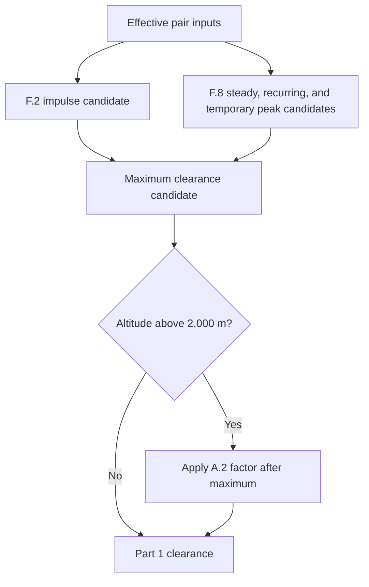
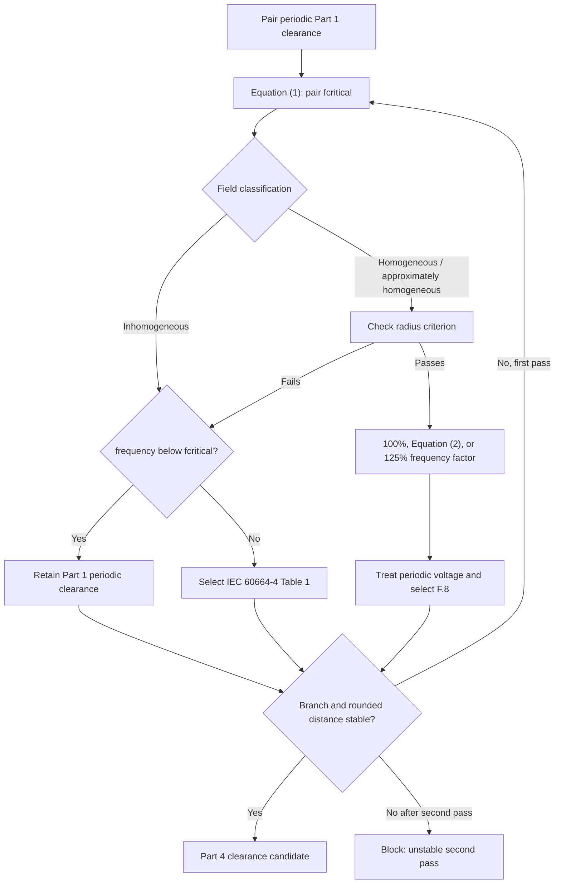
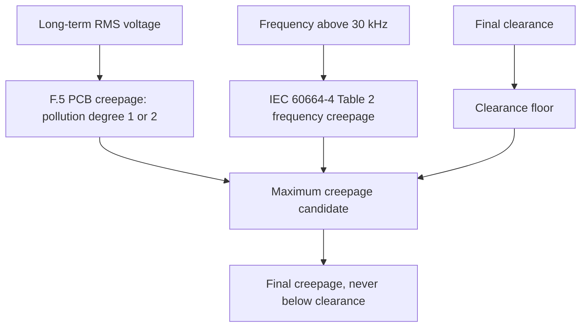

# Insulation Coordination Calculator

Offline desktop application that calculates auditable functional, basic, and reinforced
clearance and creepage requirements from approved private IEC rule packages and generates
LaTeX/PDF insulation-coordination reports.

## Highlights

- Python 3.12 + PySide6 desktop shell with a UI-independent domain engine.
- Versioned `.icproj` projects and deterministic `.icrules` rule archives.
- `Decimal`-only engineering arithmetic; every lookup, formula, substitution,
  interpolation, correction, and rounding step is traced and referenced.
- Full audit browser in the Rules Manager: tables, formulas, mappings, checksums,
  validation, and CSV/JSON inventory export.
- Offline LaTeX/PDF compilation through a pinned Tectonic executable.
- Blocked final report generation while any pair has a blocking error.
- Never executes code from rule packages; only whitelisted declarative operators.

## PCB-only product boundary

This software calculates insulation coordination for printed circuit boards only. It
supports functional, basic, and reinforced insulation with PCB construction and the
explicit IEC branches listed below. It does not silently substitute conventional
wiring or generic-material rules.

Required source inventory:

- IEC 60664-1: `iec60664-1-f2`, joined two-page `iec60664-1-f5`,
  `iec60664-1-f8`, advisory `iec60664-1-f9`, and altitude table
  `iec60664-1-a2`.
- IEC 60664-4: `iec60664-4-table-1`, `iec60664-4-table-2`, Equation (1)
  critical frequency, Equation (2) frequency factor, minimum-frequency statement,
  and radius criterion.

F.3, F.4, and IEC 60664-4 Table 5 are not calculation inputs. Older packages that
used those artifacts or placeholder formulas must be regenerated from the licensed
PDFs.

## Rules Manager review workflow

1. Import both licensed PDFs. The importer identifies exact editions and extracts
   raw grids, semantic headings, equations, mappings, footnotes, and source cells.
2. Open `Review extracted tables` with or without global notes. Opening is read-only;
   accepting a table or applying a correction requires reviewer identity and notes.
3. Review equations and mappings. This happens before `Build reviewed content`.
4. Build typed semantic tables/formulas from accepted source artifacts.
5. Approve, export, and activate the deterministic `.icrules` package.

Required-content and manual-review counts measure different things. Required content
counts one expected table, formula, or mapping. Manual review counts every approval
item, including ambiguous raw cells. Therefore the totals are not required to
match; they may be equal when every semantic artifact has exactly one review
item.

F.5 is displayed as one logical table joined from PDF pages 73 and 74. Raw display
text remains visible, including grouped thousands, ranges, qualifiers, and footnotes.
Calculation lookups use normalized numeric axes and stable semantic column IDs;
footnote letters and headings never become numeric lookup keys. Recipe-declared
merged cells, such as F.2 spans, are filled only across their covered semantic rows.

## Annex G clearance workflow



F.2 uses impulse withstand voltage. F.8 evaluates every applicable periodic peak;
blank required stresses block calculation, while explicitly not-applicable stresses
remain traceable omissions. The largest candidate governs. A.2 is applied once, after
that maximum. At 2.5 kV peak and above, F.9 produces a partial-discharge review
advisory for inhomogeneous fields; it does not replace the governing distance.
Homogeneous Case B also carries a withstand-test verification requirement.

## Pair-specific critical-frequency flow

Above 30 kHz, `fcritical` is computed independently for every pair from its governing
periodic Part 1 clearance; impulse clearance is not used as the Equation (1) input.



The engine records starting clearance, actual frequency, `fcritical`, selected branch,
frequency factor, radius ratio when relevant, and stability for each pass. At most two
passes are allowed.

## Annex H creepage workflow



F.5 interpolates only along its normalized voltage axis and selects the PCB pollution
branch exactly. Reinforced insulation doubles the F.5 result. Above 30 kHz, Table 2
adds a voltage-ceiling/frequency-linear candidate; 30–100 kHz uses its 100 kHz band,
and pollution degree 2 applies its declared multiplier. Sparse unavailable source
combinations block instead of being guessed. Final creepage is the maximum of F.5,
Table 2 when applicable, and final clearance.

## Unsupported PCB conditions

Calculation blocks with a specific error for:

- non-printed-wiring construction;
- pollution degree outside 1 or 2;
- missing/unknown CTI or material group;
- conventional-construction assumption flags without an approved semantic mapping;
- missing required voltage, frequency, field, insulation, or geometry input;
- homogeneous high-frequency routing without electrode radius;
- value outside a declared table/rule range or a sparse unavailable source cell;
- altitude outside A.2 coverage;
- an unstable second Part 4 pass; or
- obsolete schema/importer packages.

## Trace interpretation

Each result records effective inputs, all candidates, omissions, maximum/floor
selection, normalized values, interpolation/lookup mode, formula substitution,
rounding, source cells, source table/equation, warnings, and verification requirements.
The report is blocked when any pair cannot produce a complete trace.

## Implementation map

| Workflow step | Implementation | Focused verification |
| --- | --- | --- |
| Pair orchestration and maxima | [`calculate_pair`](src/insulation_coordination/calculation/engine.py) | [`tests/test_end_to_end.py`](tests/test_end_to_end.py) |
| Annex G candidates | [`calculate_clearance_candidates`](src/insulation_coordination/calculation/clearance.py) | [`tests/calculation/test_part1.py`](tests/calculation/test_part1.py) |
| Pair `fcritical` | [`calculate_critical_frequency`](src/insulation_coordination/calculation/high_frequency.py) | [`tests/calculation/test_high_frequency.py`](tests/calculation/test_high_frequency.py) |
| Part 4 clearance passes | [`assess_part4_clearance`](src/insulation_coordination/calculation/high_frequency.py) | [`tests/calculation/test_high_frequency.py`](tests/calculation/test_high_frequency.py) |
| A.2 correction | [`apply_a2_altitude_correction`](src/insulation_coordination/calculation/high_frequency.py) | [`tests/calculation/test_high_frequency.py`](tests/calculation/test_high_frequency.py) |
| Annex H candidates | [`calculate_creepage_candidates`](src/insulation_coordination/calculation/creepage.py) | [`tests/calculation/test_part1.py`](tests/calculation/test_part1.py) |
| Joined F.5 PCB selection | [`select_f5_pcb_creepage`](src/insulation_coordination/calculation/creepage.py) | [`tests/calculation/test_part1.py`](tests/calculation/test_part1.py) |
| Part 4 Table 2 | [`select_part4_table2_creepage`](src/insulation_coordination/calculation/high_frequency.py) | [`tests/calculation/test_high_frequency.py`](tests/calculation/test_high_frequency.py) |
| PDF review/build/approval | [`rules/importer`](src/insulation_coordination/rules/importer/) | [`tests/private/test_supplied_standards.py`](tests/private/test_supplied_standards.py) |

## Development

```bash
uv sync --locked --all-groups
uv run ruff check .
uv run mypy
uv run pytest
```

## Desktop

```bash
uv run icc --gui
```

## Packaging

- Windows: `packaging/insulation_coordination.spec` (PyInstaller) +
  `installer/insulation-coordination.iss` (Inno Setup).
- macOS: same spec with `--windowed`; bundle as `.app` with document types.
- CI: `.github/workflows/windows-package.yml` and `.github/workflows/macos-package.yml`.
- See `docs/release-checklist.md` for the acceptance matrix.

Private licensed IEC PDFs, `.icrules`, `.icproj`, audits, and derived values stay local
and are never committed (`/.gitignore`).
