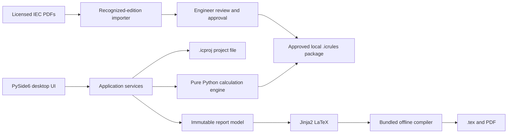

# Insulation Coordination Calculator - Design Specification

**Status:** Approved design
**Date:** 2026-07-30
**Target platform:** Offline Windows desktop application
**Standards basis:** IEC 60664-1:2020 and IEC 60664-4:2005, supplied under the user's licence

## 1. Purpose

The application automates the repetitive, error-prone preparation of an Insulation Coordination document for power-electronics projects. Engineers define electrical net classes, enter the voltage stress and insulation characteristics for every unique net-class pair, and receive traceable required clearance and creepage distances.

The application produces:

1. a complete pair matrix containing the inputs and calculated clearance and creepage results;
2. detailed calculation chapters that show all candidates and the governing requirement;
3. safe automatic grouping of pairs with identical calculation characteristics;
4. editable LaTeX source and a compiled PDF; and
5. a portable project file stored with the engineering project.

The application is a calculation aid. It does not claim product certification or replace engineering review of standard applicability, construction details, test requirements, or product-specific standards.

## 2. Version-1 goals

- Run completely offline on Windows for a small engineering team.
- Save and load a portable, human-readable `.icproj` project file.
- Define net classes once and create every unordered net-class pair automatically.
- Enter voltage stress manually for each pair.
- Use project defaults with visible pair-level overrides for environmental, construction, frequency, impulse, and insulation inputs.
- Calculate basic and reinforced clearance and creepage requirements under the supported rules from IEC 60664-1 and IEC 60664-4.
- Preserve a reproducible audit trace for every calculated value.
- Import licensed PDFs into a locally reviewed `.icrules` package without publishing IEC data.
- Allow an approved `.icrules` package to be shared internally with colleagues who are covered by the company's IEC licence.
- Generate both `.tex` and PDF output.

## 3. Explicit non-goals for version 1

- Automatic derivation of pair voltages from net-class nominal values, waveforms, switching states, or schematics.
- Cloud storage, accounts, simultaneous editing, or a central server.
- Functional or supplementary insulation calculations.
- Solid-insulation dimensioning or dielectric test design.
- Reduced distances based on coating, potting, or moulding under IEC 60664-3.
- Automated special-path treatment for ribs, mixed materials, multiple pollution degrees, floating conductive parts, or reduced short-duration creepage stress.
- PCB layout, netlist, or EDA-tool import.
- Automatic support for unknown standard editions or arbitrary PDF layouts.
- Cryptographic organizational signing of `.icrules` packages. Version 1 provides integrity hashes and approval metadata; formal signing can be added later.

Unsupported conditions are not silently approximated. They block a final calculation for the affected pair and explain which engineering assessment or additional standard is required.

## 4. Chosen solution

The product is a native Python desktop application using PySide6. The calculation engine is a pure Python domain package that has no dependency on the UI. Project serialization, rules-package handling, calculation, grouping, and report generation are separate modules with defined interfaces.



### 4.1 Component boundaries

#### Desktop UI

- project metadata and defaults;
- net-class management;
- coverage matrix and bulk pair list;
- selected-pair editor;
- calculation review and warnings;
- standards/rules manager;
- grouping controls;
- report preview and export.

The UI presents domain results but contains no calculation logic.

#### Application services

- create, open, validate, migrate, and atomically save projects;
- resolve project defaults and pair overrides;
- locate and validate the required rules package;
- orchestrate calculation of all pairs;
- build groups and the immutable report model;
- call the LaTeX renderer and compiler.

#### Domain engine

- validate domain inputs and standard scope;
- calculate clearance candidates;
- calculate creepage candidates;
- select governing values;
- produce typed trace steps and warnings;
- remain deterministic for the same project, engine version, and rules-package hash.

#### Rules importer and manager

- identify supported standard editions;
- extract a draft rules package from recognized PDFs;
- run structural and semantic extraction checks;
- present extracted content for human review;
- approve and export `.icrules`;
- import internally shared `.icrules` packages;
- verify package and file hashes before use.

#### Report generator

- convert validated results into a report model;
- render a version-controlled Jinja2 LaTeX template;
- compile with a pinned Tectonic executable and offline resource bundle;
- retain `.tex` and a readable compilation log when PDF compilation fails.

## 5. Public/private data boundary

The public GitHub repository contains:

- application and generic calculation-engine source code;
- project and rule-package schemas;
- edition-specific extraction recipes that do not contain extracted IEC values;
- synthetic rule fixtures and synthetic calculation examples;
- tests that do not reproduce licensed IEC tables;
- documentation and report templates.

The public repository does not contain:

- IEC PDF files;
- extracted IEC numeric tables or edition-specific private rule data;
- approved `.icrules` packages;
- engineering `.icproj` files;
- temporary table extraction workspaces.

The repository ignores `/standards/`, `/private-rules/`, `/rule-workspaces/`, `*.icrules`, `*.icproj`, `/.superpowers/`, and generated-report directories.

An `.icproj` stores the required rule-pack identifier and SHA-256 hash, not its contents. Opening a project with a missing or different rules package blocks calculation until the exact package is installed or the project is deliberately migrated and recalculated.

The application cannot determine whether a person is licensed to use or share a standard. Users and their organization remain responsible for complying with the applicable IEC licence.

## 6. File formats

### 6.1 `.icproj`

`.icproj` is UTF-8 JSON with a custom extension. It is intended to be portable, inspectable, diffable, and migratable.

The root document contains:

- `schema_version`;
- stable project UUID;
- project title, customer, document number, revision, author, checker, and approver metadata;
- application version last used to save the file;
- required rules-package ID, version, and SHA-256 hash;
- canonical display-unit preferences;
- project defaults;
- ordered net-class definitions;
- unordered pair cases;
- manual group-split presentation metadata;
- optional report metadata.

Inputs are serialized in canonical units:

- voltage in volts;
- frequency in hertz;
- altitude in metres;
- electrode dimensions in millimetres;
- calculated distances in millimetres.

Decimal engineering values are parsed and calculated with decimal arithmetic. The serialized representation preserves the user's entered precision and avoids binary floating-point changes.

Calculated results are derived data, not project authority. They are recomputed on load and before report generation. A future cache may be added only if it is keyed by the full input, engine, and rules-package hashes.

Project saves use write-to-temporary-file, flush, and atomic replacement. A failed save leaves the previously valid file intact.

### 6.2 `.icrules`

`.icrules` is a ZIP container with deterministic, canonical JSON members:

- `manifest.json`: package schema, semantic standard IDs, editions, importer version, source PDF hashes, creation time, approver identity, approval time, and notes;
- `rules.json`: private numeric tables, edition-specific parameters, supported ranges, interpolation and rounding declarations, and semantic rule mappings;
- `checksums.json`: SHA-256 hashes of all other package members.

The package contains no original PDF pages, screenshots, or extracted standard prose beyond the minimal identifiers needed for traceable calculations.

Checksums detect accidental or post-approval changes and allow a project to pin an exact package. They do not prove organizational authorship against a malicious actor. Cryptographic signing is deferred.

## 7. Standards import and approval

Version 1 supports the supplied IEC 60664-1:2020 and IEC 60664-4:2005 editions and their recognized layout variants.

The import flow is:

1. The maintainer selects or places the licensed PDFs in a local `standards/` directory.
2. The importer identifies document number, edition, language/layout family, and full-file hash.
3. Unsupported editions or ambiguous identification are rejected.
4. Edition-specific extraction recipes create a draft rules package.
5. Structural checks verify expected table identities, dimensions, data types, monotonic relationships where applicable, required notes, and supported ranges.
6. The review UI shows each extracted rule set alongside the relevant locally rendered source page or region.
7. The engineer confirms or corrects the draft and records approval metadata.
8. The application exports the approved `.icrules` package.
9. Colleagues import that file locally; their projects pin its exact hash.

Calculations cannot use a draft or unapproved rules package.

IEC 60664-4:2005 references an older IEC 60664-1 edition and older table numbering, while the supplied Part 1 is the 2020 edition. The `.icrules` manifest therefore uses semantic rule identifiers rather than assuming table numbers are compatible. The maintainer must explicitly approve the mapping between the Part 4 references and the selected Part 1 rules. The application blocks the combined ruleset if that compatibility mapping is absent.

## 8. Domain model

### 8.1 Project

A project owns metadata, defaults, net classes, pair cases, the required rules-package identity, and report-presentation choices.

### 8.2 Net class

A net class has:

- stable UUID;
- unique display name;
- optional description and engineering notes;
- display order.

Electrical stresses are not inferred from a net class in version 1.

### 8.3 Pair case

For `N` net classes, the application creates `N × (N - 1) / 2` unique unordered pairs. The diagonal represents the same net and has no case. The lower half of the coverage matrix mirrors the upper half. A pair is stored using a canonical ordering of its two stable net-class IDs, so A-to-B and B-to-A can never diverge.

A pair owns:

- stable case ID used by the UI and report;
- manual pair voltage inputs;
- optional overrides of project defaults;
- notes and explicit not-applicable justifications;
- calculation status;
- presentation split assignment.

### 8.4 Effective conditions

Before calculation, the resolver combines project defaults with pair overrides into one immutable effective input object. Every field records its provenance as `project_default` or `pair_override`.

### 8.5 Result and trace

A pair result contains:

- all clearance candidates;
- governing clearance before and after corrections;
- all creepage candidates;
- the clearance floor applied to creepage;
- final required clearance and creepage;
- warnings, verification requirements, and blocking errors;
- ordered trace steps.

Each trace step records:

- semantic rule ID and human-readable clause/table reference;
- input values used;
- operation, lookup, interpolation, correction, scaling, maximum selection, or rounding;
- unrounded and rounded output where applicable;
- concise reason.

## 9. Input model

### 9.1 Project defaults with pair overrides

The following fields can be project defaults and can be overridden by a pair:

- required impulse withstand voltage;
- fundamental or relevant periodic frequency;
- insulation type (`basic` or `reinforced`);
- electrical field condition;
- electrode radius where required for the high-frequency field assessment;
- altitude;
- pollution degree;
- printed-wiring-material versus other-material construction;
- CTI or material group;
- applicable conventional construction assumptions.

Frequency and impulse voltage explicitly follow this default-plus-override model.

### 9.2 Pair voltage inputs

Version 1 requires manual pair entry for:

- long-term RMS design voltage used for tracking;
- steady-state peak voltage;
- recurring peak voltage;
- peak temporary overvoltage;
- required impulse withstand voltage when it is not inherited;
- frequency when it is not inherited.

The high-frequency periodic peak is determined from the applicable entered periodic peak stresses, with the chosen inputs shown in the trace. A voltage category that is genuinely not applicable must be marked `not applicable` with an engineering justification; blank and not-applicable are distinct states.

### 9.3 Conservative defaults and special conditions

- Inhomogeneous field is the safe default.
- Selecting homogeneous or approximately homogeneous field requires the additional geometry data needed by the applicable rules and emits any required withstand-test warning.
- For IEC 60664-4 approximately homogeneous evaluation, the engine checks the electrode-radius criterion against the calculated clearance and performs the bounded recalculation required by the approved rules package. Failure to satisfy the criterion routes the case to the inhomogeneous path.
- The normal creepage model assumes long-term voltage stress, one insulating-material path, and no distance reduction by ribs.
- Coating/potting, rib reduction, split materials or pollution degrees, floating conductive parts, or short-duration reduction are declared through special-condition flags. They block the unsupported automated path rather than being ignored.
- Printed wiring material is an explicit construction selection. The UI explains when additional protection or construction confirmation is required by the approved rule.

## 10. Calculation pipeline

### 10.1 Pre-calculation validation

The engine verifies:

- an approved, checksum-valid, compatible rules package is installed;
- every required field is present or explicitly not applicable;
- values and combinations are within the package's supported scope;
- required geometry is present for the selected field condition;
- no unsupported special condition is active.

Blocking validation errors produce no final distance.

### 10.2 Clearance

For each pair:

1. Calculate the IEC 60664-1 transient/impulse clearance candidate.
2. Calculate the IEC 60664-1 steady-state peak, temporary-overvoltage, and recurring-peak candidates.
3. Apply the rules-package treatment for basic or reinforced insulation to the correct candidate inputs.
4. Apply the selected field condition and pollution degree.
5. If the relevant frequency is above 30 kHz, calculate the IEC 60664-4 periodic-voltage candidate using the applicable homogeneous/approximately homogeneous or inhomogeneous method.
6. Retain every candidate and select the largest applicable requirement.
7. Apply altitude correction when required.
8. Record required verification or partial-discharge warnings without silently changing the result.

All iterative high-frequency evaluations have a fixed convergence rule, maximum iteration count, and complete trace. Non-convergence is a blocking error.

### 10.3 Creepage

For each pair:

1. Calculate the IEC 60664-1 tracking candidate from long-term RMS voltage, pollution degree, construction type, and material group/CTI.
2. Apply permitted interpolation, rounding, and the approved basic/reinforced treatment.
3. If frequency is above 30 kHz, calculate the IEC 60664-4 deterioration candidate from periodic peak voltage, frequency, pollution degree, and applicable material treatment.
4. Retain all candidates and select the largest applicable requirement.
5. Enforce final creepage greater than or equal to the associated final clearance.

The trace states which candidate governed and why.

## 11. User workflow

The main navigation is:

1. **Project defaults** - metadata, rules package, common environment and construction.
2. **Net classes** - add, rename, order, and describe net classes.
3. **Pair matrix** - coverage overview, bulk pair table, and selected-pair editor.
4. **Calculation review** - results, traces, warnings, blocking cases, and automatic groups.
5. **Report** - group splits, metadata, preview, `.tex`, and PDF export.

The pair workspace combines:

- a square coverage matrix showing complete, incomplete, warning, and selected states;
- a sortable flat list with one row per unique pair for efficient bulk editing;
- a detailed editor for the selected pair;
- visible `Default` and `Override` markers on every inherited field.

The square matrix never stores a second copy of mirrored pair data.

## 12. Grouping

The engine computes a deterministic calculation signature from:

- rules-package hash and engine calculation version;
- all effective inputs;
- input applicability decisions;
- calculation branch and semantic rules used;
- interpolation, correction, and rounding behavior;
- all candidates and final results;
- relevant warnings and verification requirements.

Pairs with identical signatures are grouped automatically. An engineer may split an automatic group for document readability. The UI refuses to merge cases with different signatures. Manual splits affect presentation only and never alter calculations.

## 13. Report design

The generated document contains:

1. cover and document-control metadata;
2. scope, standards editions, rules-package ID/hash, project assumptions, and defaults;
3. net-class definitions;
4. one authoritative landscape pair matrix;
5. grouped detailed calculations;
6. non-blocking warnings and verification requirements;
7. rules-package provenance and approval metadata.

The pair matrix includes:

- pair ID and both net classes;
- RMS and all applicable peak voltage inputs;
- impulse and frequency;
- insulation type;
- field, PCB/material, CTI/material group, pollution, and altitude information;
- visible default/override indication where useful;
- required clearance and creepage;
- governing path and calculation-group reference.

The matrix uses repeated headers and spans landscape pages as needed.

Each grouped calculation chapter lists the included pairs, effective characteristics, all calculation candidates, references, transformations, governing selections, corrections, final distances, and warnings.

Report generation is deterministic:

```text
validated .icproj + exact .icrules + engine version
    -> immutable report model
    -> Jinja2 LaTeX
    -> editable .tex
    -> pinned offline Tectonic
    -> PDF
```

Final report generation is blocked while any project pair has a blocking error. Blocking and unsupported cases remain visible in the calculation-review UI until resolved. A LaTeX compilation failure retains the `.tex` source and compiler log.

## 14. Validation and error handling

- Inline validation marks missing or invalid inputs without waiting for report generation.
- Changing any effective input immediately invalidates the old calculation and group membership.
- Unknown standard editions and ambiguous PDF extractions are rejected.
- Draft, altered, missing, or incompatible rules packages block calculation.
- Out-of-range values identify the exact field, supplied value, supported range, and applicable rule.
- Unsupported standards paths identify the additional standard or engineering assessment required.
- Project schema migration is explicit, versioned, and tested. A failed migration never overwrites the source file.
- Rules-package migration always produces a new package identity and requires renewed approval.
- Errors shown to users are actionable; internal exceptions are logged with technical context but do not expose licensed rule contents unnecessarily.

## 15. Verification strategy

Accuracy is treated as a product feature, not only a testing phase.

### 15.1 Rules extraction tests

- recognized-document and edition identification;
- source-hash recording;
- expected table and rule counts;
- expected dimensions, types, units, and required metadata;
- monotonic and cross-table consistency assertions where technically valid;
- deterministic canonical package generation;
- corruption and checksum rejection;
- review and approval state transitions.

### 15.2 Calculation tests

- every supported table boundary;
- values immediately below, at, between, and above boundaries;
- interpolation and rounding;
- basic versus reinforced behavior;
- altitude boundaries and interpolation;
- pollution degree, CTI/material group, and PCB branches;
- 30 kHz transition and all supported high-frequency regions;
- field-condition routing and bounded iteration;
- maximum-candidate selection;
- creepage floor against clearance;
- unsupported-range and unsupported-condition failures.

Golden engineering cases store complete expected traces, not only final numbers, and are independently checked against the licensed standards.

### 15.3 Property tests

Where technically valid for a fixed set of other inputs:

- reinforced requirements are not below basic requirements;
- increasing altitude above the base range does not reduce clearance;
- the final clearance is not below any applicable clearance candidate;
- the final creepage is not below any applicable creepage candidate or final clearance;
- swapping the two net classes does not change the result;
- identical effective inputs produce identical signatures and results.

### 15.4 File, UI, report, and packaging tests

- `.icproj` save/load round trips and schema migrations;
- atomic-save failure recovery;
- project/ruleset hash mismatch behavior;
- pair generation when net classes are added or removed;
- grouping and manual split behavior;
- LaTeX escaping and stable report snapshots;
- PDF rendering checks for clipped tables, unreadable text, bad page breaks, and missing headers;
- Windows GUI smoke tests;
- clean Windows installer test with no preinstalled Python or LaTeX.

No calculation rule is considered ready until its extracted data has been reviewed and its behavior is covered by boundary and golden-case tests.

## 16. Packaging and deployment

- Python and application dependencies are pinned.
- PyInstaller produces the application bundle.
- A Windows installer provides file association for `.icproj` and optional association for `.icrules`.
- The installer bundles a pinned Tectonic executable and offline resource bundle so PDF generation requires no network or separate LaTeX installation.
- The installed application stores approved rules packages in the user's local application-data directory.
- Projects remain wherever the engineer chooses and can be archived with the containing engineering project.
- Application updates never replace, publish, or upload private standards or rules packages.

## 17. Acceptance criteria

Version 1 is acceptable when:

1. An engineer can import the two supplied IEC PDFs, review the extraction, and export an approved private `.icrules`.
2. Another engineer can install that `.icrules` locally without access to the original maintainer workspace.
3. An engineer can create net classes and the application creates every unique pair exactly once.
4. Every pair supports the agreed manual inputs and default/override behavior, including frequency and impulse voltage.
5. Supported pairs produce deterministic clearance, creepage, and complete traces.
6. Unsupported or incomplete cases cannot produce a misleading final result.
7. Identical cases group automatically; engineers can split but cannot incorrectly merge groups.
8. Saving and reopening an `.icproj` reproduces the same inputs and, with the exact rules package and calculation-engine version, the same results.
9. The generated `.tex` and PDF contain the matrix and grouped detailed calculations without layout defects.
10. The public repository contains none of the licensed PDFs, private extracted IEC data, `.icrules`, or engineering projects.

## 18. Future extensions

The architecture deliberately leaves room for:

- automatic voltage derivation from net-class waveform models;
- functional and supplementary insulation;
- solid-insulation and test calculations;
- IEC 60664-3 coating/potting support;
- cryptographically signed organizational rules packages;
- EDA/netlist import;
- organization-specific report templates;
- a local web or centrally hosted UI using the same domain engine.
